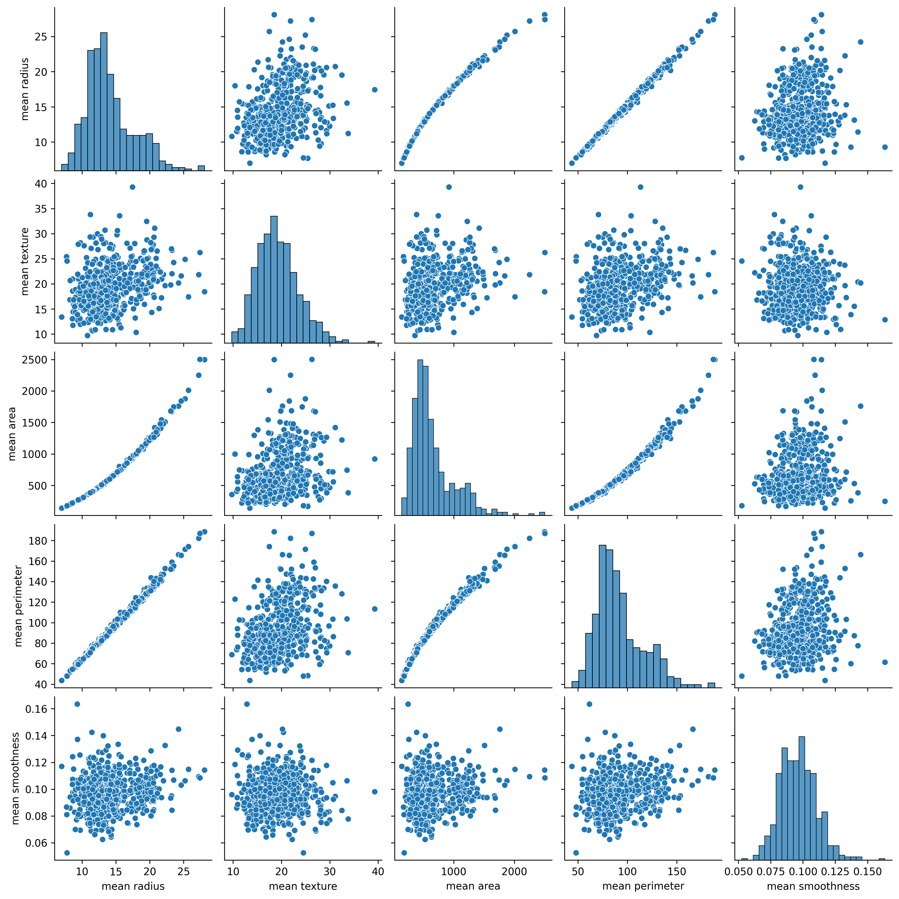
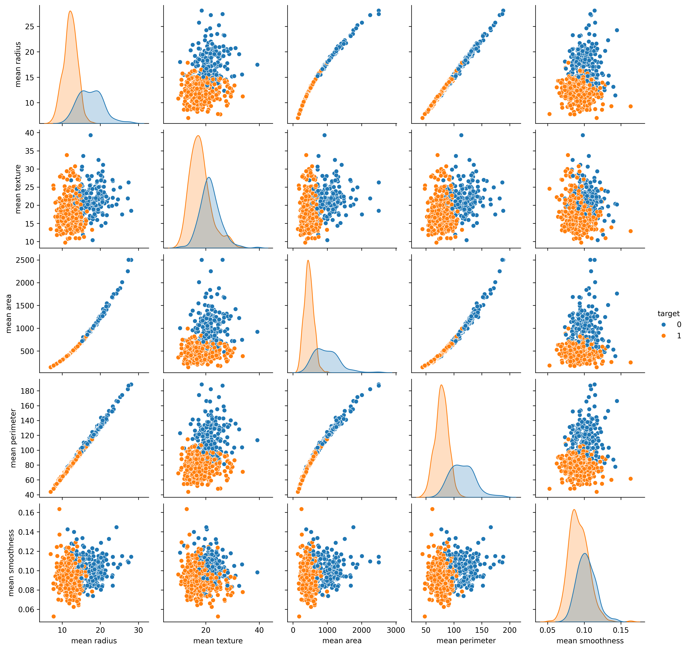
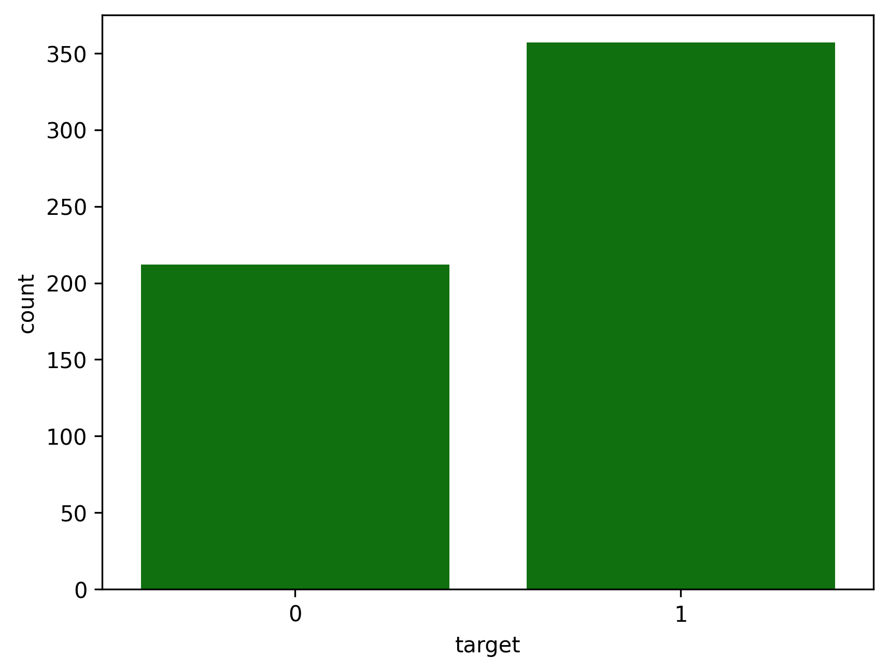
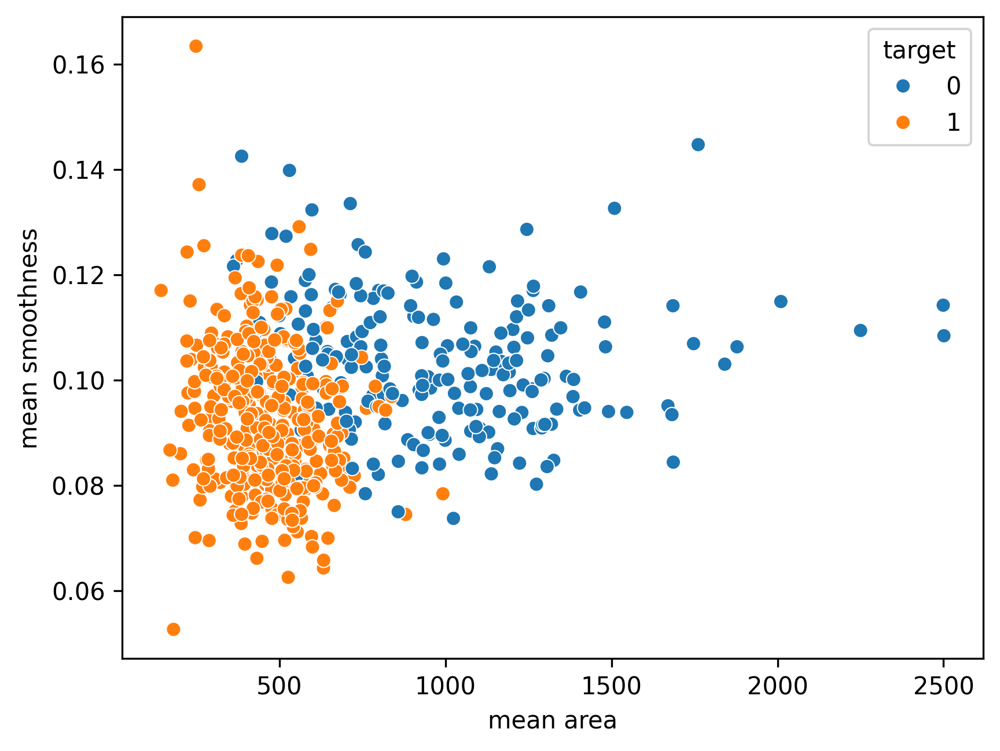
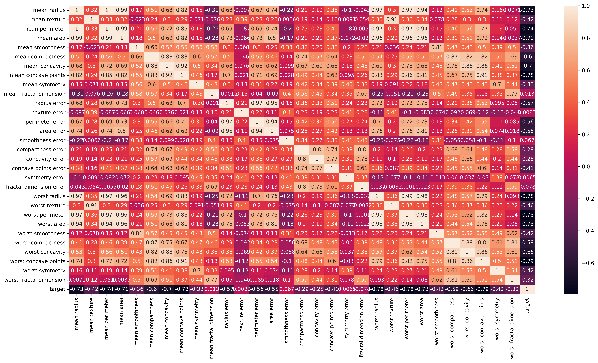

# Breast Cancer Classification using Machine Learning

*A comprehensive end-to-end machine learning pipeline for breast cancer classification using the Wisconsin Diagnostic Breast Cancer (WDBC) dataset.*

---

## 📋 Table of Contents

- [Overview](#overview)
- [Dataset Description](#dataset-description)
- [Exploratory Data Analysis (EDA)](#exploratory-data-analysis-eda)
  - [Pair Plots](#pair-plots)
  - [Class Distribution](#class-distribution)
  - [Feature Relationships](#feature-relationships)
  - [Correlation Heatmap](#correlation-heatmap)
- [Modeling and Evaluation](#modeling-and-evaluation)
  - [Models Used](#models-used)
  - [Model Comparison](#model-comparison)
  - [ROC Curves](#roc-curves)
  - [Cross-Validation Accuracy](#cross-validation-accuracy)
  - [Confusion Matrix](#confusion-matrix)
- [Conclusion](#conclusion)
- [References](#references)

---

## ✅ Overview

This project aims to classify breast cancer as **benign** or **malignant** using various machine learning algorithms. The analysis involves exploratory data visualization, feature correlation studies, and multiple classification models evaluated on metrics like accuracy, precision, recall, F1 score, and ROC AUC.

---

## 🧬 Dataset Description

The dataset used is the **Breast Cancer Wisconsin (Diagnostic) Dataset**, which includes features computed from digitized images of a fine needle aspirate (FNA) of breast mass. The target variable is binary:
- **0**: Malignant
- **1**: Benign

---

## 📊 Exploratory Data Analysis (EDA)

### 📌 Pair Plots

The pair plots show relationships among selected features:

   
  <em>Figure 1: Pairwise relationships between selected features</em>

   
  <em>Figure 2: Pairwise feature relationships colored by target class</em>

---

### 📌 Class Distribution

The class distribution of the target shows an imbalance favoring benign tumors:

   
  <em>Figure 3: Distribution of target variable (0 = Malignant, 1 = Benign)</em>

---

### 📌 Feature Relationships

Feature scatter plots (example: `mean area` vs. `mean smoothness`) show visible separation between classes:

   
  <em>Figure 4: Mean Area vs Mean Smoothness colored by target</em>

---

### 📌 Correlation Heatmap

Feature correlation helps identify redundancy and multicollinearity:

   
  <em>Figure 5: Correlation heatmap of features</em>

---

## 🤖 Modeling and Evaluation

### 🔍 Models Used

The following classification models were trained and tested:

- Logistic Regression
- Random Forest
- XGBoost
- Support Vector Machine (SVM)

---

### 📊 Model Comparison

Model performance was evaluated using multiple metrics:

   
  <em>Figure 6: Accuracy, Precision, Recall, F1 Score, and ROC AUC for each model</em>

---

### 📈 ROC Curves

ROC curves show the trade-off between true positive rate and false positive rate:

   
  <em>Figure 7: ROC Curve comparison across models</em>

---

### 📌 Cross-Validation Accuracy

Cross-validation provides a robust estimate of generalization performance:

   
  <em>Figure 8: 5-Fold CV accuracy ±1 standard deviation</em>

---

### 🧮 Confusion Matrix

The confusion matrix for the best model (Random Forest) is shown below:

   
  <em>Figure 9: Confusion Matrix of Random Forest</em>

---

## ✅ Conclusion

- **Random Forest** and **XGBoost** achieved the best performance across all evaluation metrics.
- The features `mean radius`, `mean area`, and `mean perimeter` are highly predictive and strongly correlated with malignancy.
- Proper EDA, correlation analysis, and model evaluation are essential for building trustworthy medical ML models.

---

## 📚 References

1. UCI Machine Learning Repository: [Breast Cancer Wisconsin (Diagnostic) Data Set](https://archive.ics.uci.edu/ml/datasets/Breast+Cancer+Wisconsin+(Diagnostic))
2. Scikit-learn Documentation: https://scikit-learn.org
3. XGBoost Documentation: https://xgboost.readthedocs.io
4. Seaborn Library: https://seaborn.pydata.org

---

## 📂 Image Reference Table

| Image | Filename |
|-------|----------|
| Figure 1 | `pairplot_features_only.png` |
| Figure 2 | `pairplot_with_target.png` |
| Figure 3 | `class_distribution.png` |
| Figure 4 | `mean_area_vs_smoothness.png` |
| Figure 5 | `correlation_heatmap.png` |
| Figure 6 | `model_performance_comparison.png` |
| Figure 7 | `roc_curves.png` |
| Figure 8 | `cross_validation_accuracy.png` |
| Figure 9 | `confusion_matrix_rf.png` |
