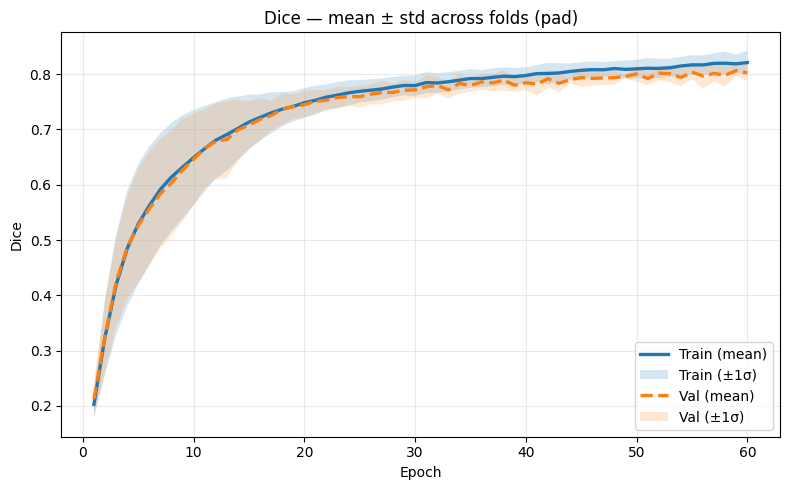
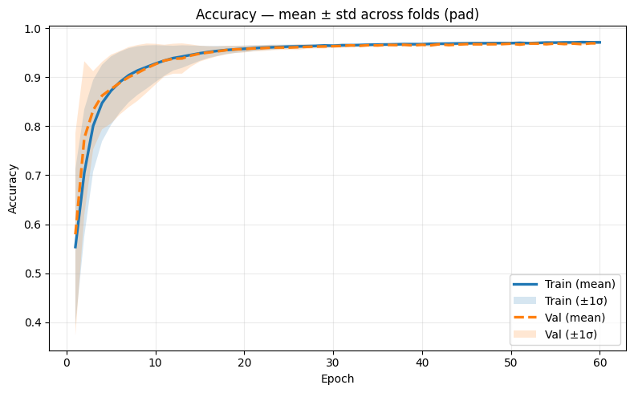
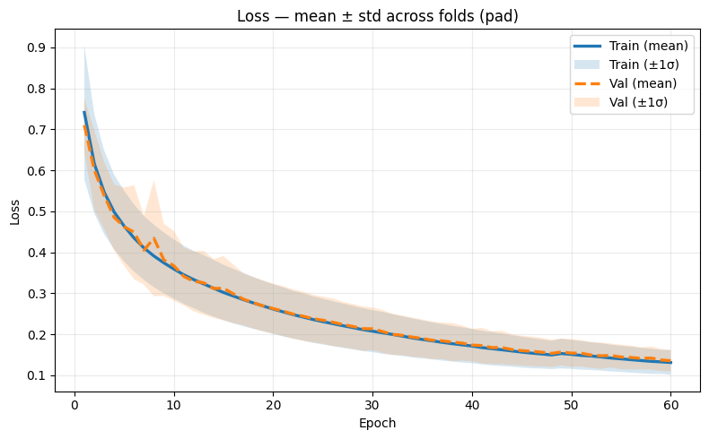
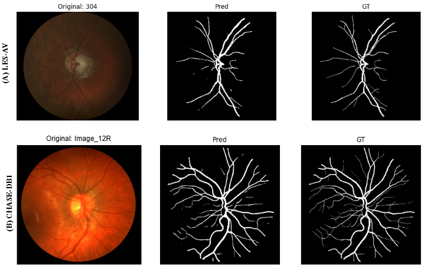

# Experimental Evaluation of Public Retinal Vessel Segmentation Datasets (2020–2025) with Deep Learning: An Empirical Study

## Authors

Robert Ngabo Mugisha¹  
Geoffrey Munyaneza²  
Fidele Nsanzumukunzi³  
Mediatrice Dusenge⁴  
Josue Uzigusenga⁵  
Theophilla Igihozo⁶  
Fabrice Mpozenzi⁷  
Emmanuella Nuwayo⁵  
Prince Shema Musonerwa¹  
Benny Uhoranishema¹  
Jean De Dieu Niyonteze⁸  

---

## 🏛️ Affiliations

¹ College of Engineering, Carnegie Mellon University Africa, Kigali, Rwanda  
² Kenan-Flagler Business School, University of North Carolina, United States  
³ The Roux Institute, Northeastern University, Portland, ME, United States  
⁴ African Centre of Excellence in Data Science, University of Rwanda, Kigali, Rwanda  
⁵ College of Science and Technology, University of Rwanda, Kigali, Rwanda  
⁶ College of Medicine and Health Sciences, University of Rwanda, Kigali, Rwanda  
⁷ Department of Computer Science, Abilene Christian University, Abilene, Texas, United States  
⁸ Goizueta Business School, Emory University, Atlanta, GA, United States  
 
 

##  Project Overview

This study presents a standardized benchmarking analysis of eleven public retinal vessel segmentation datasets (2020–2025) using the UNet++ architecture under identical experimental conditions. Eight datasets were fully evaluated with five-fold cross-validation to ensure fairness and reproducibility. Results reveal significant performance variability driven by image resolution, annotation quality, and dataset size. The RETA Benchmark achieved the highest segmentation performance, while CHASE-DB1, AV-DRIVE, HRF, and STARE also demonstrated strong reliability. Overall, the study highlights the critical role of dataset quality and the need for harmonized, large-scale retinal benchmarks for robust deep learning research.

## Key Contributions
- Systematic evaluation of **11 retinal vessel segmentation datasets**
- Unified preprocessing pipeline (CLAHE, resizing, normalization)
- 5-fold cross-validation on all datasets
- Deployment of U-Net++ architecture for deep semantic segmentation
- Open-source code for reproducibility

## Datasets
This study used publicly available retinal vessel segmentation datasets from 2020–2025, including DRIVE, STARE, CHASE-DB1, HRF, RETA Benchmark, RITE, FIVES, AV-DRIVE, LES-AV, OCTA-500, and IOSTAR. For AV-DRIVE, artery and vein labels were merged into a single binary vessel mask, and ambiguous pixels at crossings were treated as background for consistency.

## Preprocessing

All images were:
- Resized to **512 × 512 pixels**
- Normalized to a standard intensity range
- Enhanced using **Contrast-Limited Adaptive Histogram Equalization (CLAHE)** to improve vessel visibility and local contrast.
## Model Architecture
We adopt **U-Net++** for retinal vessel segmentation due to its strong ability to capture multi-scale information via densely nested skip connections.

### Model Specifications:
- Backbone: U-Net++ encoder-decoder
- Activation: ReLU
- Optimizer: Adam (lr = 1e-4)
- Loss: Binary Cross-Entropy
- Batch Size: 6
- Epochs: 60

## Results and Discussion – U-Net++ Segmentation

| Dataset | Year | Dice (Mean ± Std) | Accuracy (Mean ± Std) | Notes |
|---------|------|------------------|----------------------|-------|
| RETA Benchmark | 2022 | 0.80 ± 0.015 | 0.97 ± 0.016 | Top performer; high-quality images, precise annotations, strong generalization |
| CHASE-DB1 | 2012 | 0.74 ± 0.005 | 0.97 | Robust despite smaller dataset size; captures fine branches & bifurcations |
| AV-DRIVE | 2013 | 0.73 ± 0.011 | 0.97 | Reliable artery–vein benchmark; robust with small dataset |
| STARE | 1998–2000 | 0.72 ± 0.002 | 0.96 | Stable Dice & accuracy |
| HRF | 2013 | 0.71 ± 0.01 | 0.96 | Limited adaptability due to small dataset size |
| IOSTAR | 2016 | 0.66 ± 0.045 | 0.93 | Lower Dice due to variable image quality and small sample size |
| LES-AV | 2018 | 0.64 ± 0.072 | 0.97 | Performance limited by inconsistent annotations; captures main vessels with minor deviations |
| DRIVE | 2004 | 0.41 ± 0.05 | 0.88 | Small sample size & vessel-background imbalance; fails to capture fine vessels |
| FIVES | 2021 | - | - | Not fully evaluated; high-resolution images → long training times (~2 days/fold) |
| OCTA-500 | 2024 | - | - | Not fully evaluated; high-resolution volumetric data → long training times |
| RITE | 2013 | - | - | Excluded due to retrieval issues during study period |

---

## Cross-Dataset Observations
- RETA Benchmark shows **superior image quality and strong generalization**  
- CHASE-DB1 & AV-DRIVE remain robust with smaller datasets  
- Lower Dice in LES-AV & IOSTAR due to **illumination variability and annotation inconsistencies**  
- U-Net++ preserves **vessel topology** across datasets  

---

## Qualitative Results

**Fig. 1–3:** Training/Validation Curves for RETA Benchmark  
- Dice coefficient, Accuracy, and Loss plotted across 5 folds  

## Fig. 4: U-Net++ Segmentation Outputs

- **CHASE-DB1:** Accurately captures fine branches & bifurcations, closely matches ground truth (GT)  
- **LES-AV:** Main vessels captured; minor deviations in low-contrast regions  

 
*LES-AV and CHASE-DB1– Predicted vs Ground Truth*  
 
