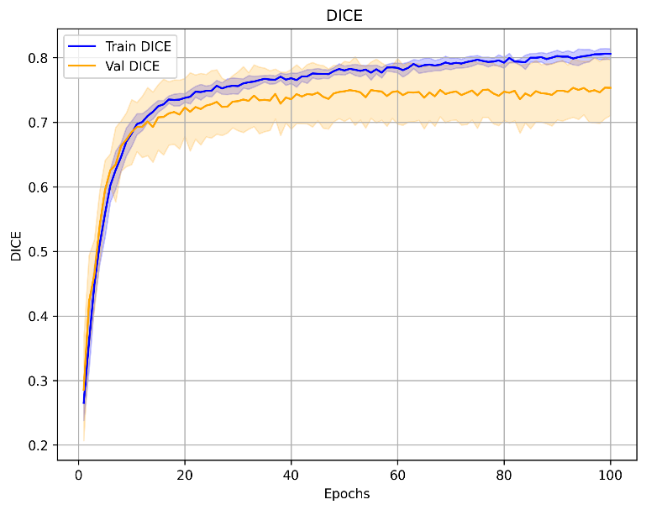
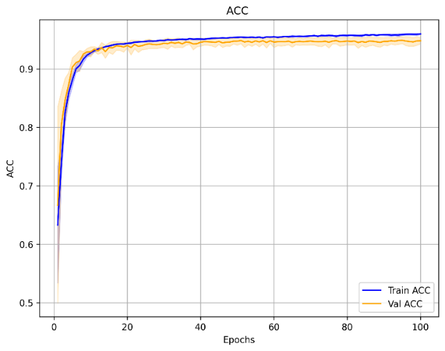
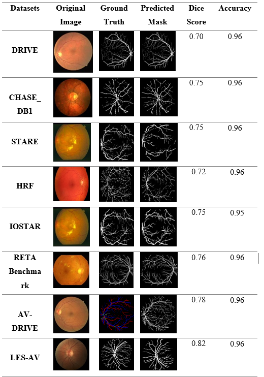

# A Performance Evaluation of Deep Learning-Driven Retinal Vessel Segmentation Using a Transformer-Based Architecture

## Authors

Yves Byiringiro¹  
Jean De Dieu Niyonteze²  
Liliane Tuyishime¹  
Mediatrice Dusenge³  
Josue Uzigusenga⁴  
Benny Uhoranishema²  

## 🏛️ Affiliations

¹ Martin J. Whitman School of Management, Syracuse University, Syracuse, NY, 13244, United States  
² Goizueta Business School, Emory University, Atlanta, GA 30322, United States  
³ African Centre of Excellence in Data Science, University of Rwanda, Kigali, Rwanda  
⁴ College of Sciences and Technology, University of Rwanda, Kigali, Rwanda  

 


## Overview

Retinal vessel segmentation is a critical step in automated ophthalmic diagnosis.  
This repository presents a comprehensive evaluation of **SegFormer**, a transformer-based architecture, across eight public retinal vessel datasets under a **unified preprocessing pipeline** and **five-fold cross-validation strategy**.

Unlike dataset-specific optimization approaches, this work focuses on evaluating **cross-dataset robustness and generalization capability**.

---

## Key Contributions

- **Multi-dataset evaluation** (8 public retinal vessel datasets)  
- **Unified preprocessing pipeline** (CLAHE + resizing + normalization)  
- **Five-fold cross-validation** for each dataset  
- **Cross-dataset prediction without fine-tuning**  
- **Robust transformer-based segmentation framework**  
- **Dice scores up to 0.82**  
- **Accuracy above 0.95 across datasets**  


## 📊 Datasets

The model was evaluated on **eight public retinal vessel datasets**:

- **DRIVE**  
- **STARE**  
- **CHASE_DB1**  
- **HRF**  
- **RETA Benchmark**  
- **AV-DRIVE**  
- **LES-AV**  
- **IOSTAR**  
## Preprocessing Pipeline

All datasets followed the **same preprocessing steps**:

1. **Resize** → 512 × 512  
2. **Intensity normalization**  
3. **CLAHE enhancement**  
4. **Binary vessel mask conversion**  

## Model Architecture

We use **SegFormer** with the following components:

- **Mix Transformer (MiT) encoder**  
- **Overlapping patch embeddings**  
- **Lightweight MLP decoder**  

## Training Strategy

- **Optimizer:** Adam  
- **Learning rate:** 1e-4  
- **Batch size:** 4  
- **Epochs:** 100  
- **GPU:** RTX 4070  
- **Cross-validation:** 5-fold per dataset  

## Results

### Cross-Validation Performance

| Dataset     | Dice Score       | Accuracy |
|------------|-----------------|----------|
| DRIVE      | 0.742 ± 0.02    | 0.952    |
| STARE      | 0.770 ± 0.012   | 0.964    |
| CHASE_DB1  | 0.764 ± 0.005   | 0.964    |
| HRF        | 0.698 ± 0.015   | 0.950    |
| IOSTAR     | 0.752 ± 0.044   | 0.951    |
| RETA       | 0.764 ± 0.008   | 0.960    |
| AV-DRIVE   | 0.768 ± 0.011   | 0.958    |
| LES-AV     | 0.780 ± 0.007   | 0.970    |


## Dice Curve (Cross-Validation)


## Accuracy Curve


## Qualitative Segmentation Results


## Cross-Dataset Generalization

The model trained **only on LES-AV** achieved:

- **Dice:** 0.70 – 0.82  
- **Accuracy:** > 0.95  

across all external datasets **without fine-tuning**.  

This demonstrates **strong transformer-based generalization**.  

## Future Work

- Evaluate Swin Transformer V2
- Investigate Mask2Former
- Improve thin-vessel segmentation
- Optimize inference speed for clinical deployment


## 📄 Paper Information

**Title:** Deep Learning-Driven Retinal Vessel Segmentation Using a Transformer-Based Architecture: A Performance Evaluation  
**Conference:** IEEE ICARC 2026  
**Status:** Accepted 
 If you use this work, please cite:

```bibtex
@inproceedings{byiringiro2026segformer,
  title={Deep Learning-Driven Retinal Vessel Segmentation Using a Transformer-Based Architecture: A Performance Evaluation},
  author={Byiringiro, Yves and Niyonteze, Jean De Dieu and Tuyishime, Liliane and Dusenge, Mediatrice and Uzigusenga, Josue and Uhoranishema, Benny},
  booktitle={IEEE ICARC},
  year={2026}
}
